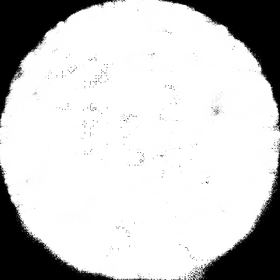
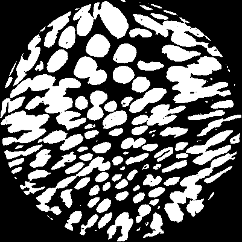
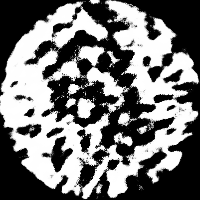
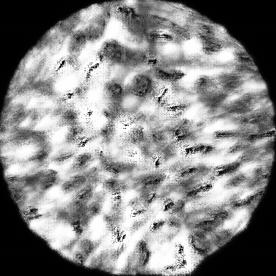

# README
## UNET Design Choices
In the forward method of my UNet, there are some repeated operations that can be easily abstracted into a function. I have chosen not to, because I don't find that abstraction necessary, especially if I plan to hook into various parts of the UNet to inspect, rather than just using it as a black box.

I also kept the naming of the variables in the forward method. While longer variables are generally encouraged for clarity, I have personally found short variables to work better when coding up mathematical operations. Specifically, I am better able to see how the variables interact with each other, and thus make it easier to discern mistyped variables.

Finally, the subclasses that I created, though they did serve the purpose of abstracting away certain operations, were also created to create an easier interface to hook into the UNet, rather than using Pytorch's own hooking mechanism. With them, I was able to print,set pdb traces, and log model statistics with ease.

## Observations
### Biased Dice Loss
It seems to me that the dice loss people are [using](http://forums.fast.ai/t/dice-loss-not-decreasing/16789) do not care about the accuracy of the bg predition, and thus is biased towards the foreground. And indeed, when I used this version of the dice loss, I got:

as compared to the label

When I implemented an unbiased dice loss(see page 2 of this [paper](https://arxiv.org/pdf/1707.03237.pdf)), I get:

After some investigation, it seems to me that the biased dice loss was introduced in a Kaggle competition, and people have been using it ever since. For the datasets that it has been used on(see [this](https://github.com/jakeoung/Unet_pytorch) and [this](https://tuatini.me/practical-image-segmentation-with-unet/)), the ground truth is a single blob, which is not the case for my dataset.

### Cross Entropy vs Dice Loss Probabilities

As compared to the dice loss predictions above, using a cross entropy loss produces an output that not as concentrated in the 0 or 1 regime.(Aka dice loss will either predict fg or bg with high certainty)I have not done further investigations as to why this may be theoretically so.
### Need for data
Given a few images, it turns out that it is very hard to overfit the train accuracy(I never got above 70 percent on 10 training images). One possible reason is that the UNet technically outputs many predictions, and so the 1by1 conv kernel at the end has to compromise on all the pixels.

### Behavior of Adam Optimizer
No matter what my other hyperparameter settings were, Adam always gave a black canvas as its final prediction. My hypothesis for the cause of this behavior is that adam is choosing a local minimum way too early, due to its adaptive learning rate quickly converging and the lack of a momentum term(by this I mean an additive term. Adam has a term that looks like a momentum, but factors in multiplicatively, not additively)

UNET is really good at detecting single blobs
https://github.com/jakeoung/Unet_pytorch or https://tuatini.me/practical-image-segmentation-with-unet/

## Final pictures
